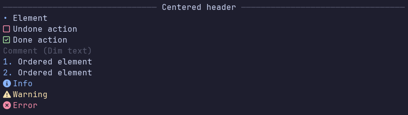

<h1 align="center">sMarkup</h1>
<p align="center">a simple, fast, terminal markup language</p>

sMarkup is a markup language designed to be displayed entirely in the terminal. it's really simple, yet has enough features for writing docs, manuals and other stuff



# features
- headers
- text dividers
- lists
- info, warnings, errors
- comments
- checkboxes
- sticky header
- progress bars (why not)

for the full list, run `bin/sMarkup examples/features.smu` after cloning the repo

# compiling

requiremenets: gcc, make

```bash
git clone https://github.com/danilaxila3/sMarkup.git
cd sMarkup
make
```

you can also add the `bin` folder to `$PATH` with:

```bash
echo 'export PATH=$PATH:$(pwd)/bin' >> ~/.bashrc
source .bashrc
```

replace .bashrc with whatever shell you use

